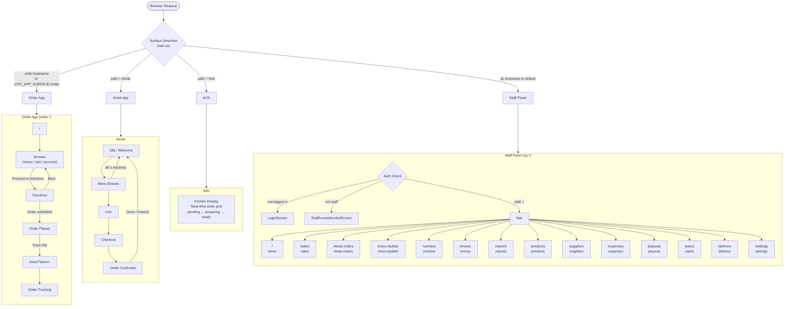

# Route Chart

> Auto-generated by `scripts/generate-route-chart.js` — do not edit by hand.
> Last updated: **2026-05-17 06:43 UTC**

## Architecture Overview

| Surface | Entry Hostname / Path | Auth |
|---|---|---|
| Order App | `order.*` or `VITE_APP_SURFACE=order` | Public |
| Kiosk | any host `/kiosk` | Secret key |
| KDS | any host `/kds` | Secret key |
| Staff Panel | `sp.*` or default | Staff login |

## Visual Diagram

## Staff Panel Routes

| Path | Screen |
|---|---|
| `/` | home |
| `/sales` | sales |
| `/kiosk-orders` | kiosk-orders |
| `/menu-builder` | menu-builder |
| `/combos` | combos |
| `/money` | money |
| `/reports` | reports |
| `/products` | products |
| `/suppliers` | suppliers |
| `/expenses` | expenses |
| `/payouts` | payouts |
| `/users` | users |
| `/delivery` | delivery |
| `/settings` | settings |

## Order App Flow

| State | Description |
|---|---|
| `browse` | Menu / cart / account tabs |
| `checkout` | Address, phone, fulfillment form |
| `done` | Confirmation + tracking link |

## Tracking

- Path: `/track?token={trackToken}`
- Public, no auth
- Real-time status updates via Supabase subscription

## Kiosk Flow

1. **idle** → 2. **menu** → 3. **cart** → 4. **checkout** → 5. **confirmation**

Inactivity timeout: 60 s → resets to **idle**

## Kitchen Display

- Single persistent view at `/kds`
- Real-time order grid: pending → preparing → ready
