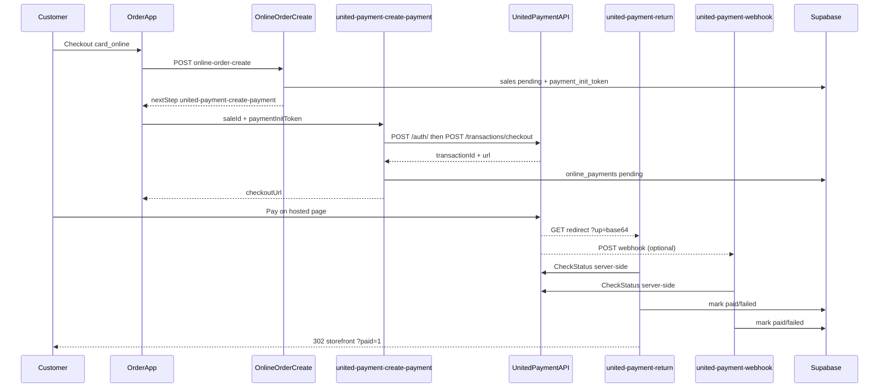

# United Payment integration (hosted checkout)

Card payments on **order.mings.az** use **United Payment** hosted checkout (`/transactions/checkout`). EPoint remains as legacy for historical `online_payments` rows.

## Architecture



## Edge functions

| Function | Role |
|----------|------|
| `united-payment-create-payment` | Auth + checkout; creates `online_payments` row |
| `united-payment-return` | Browser redirect handler; decodes `up`, re-confirms status |
| `united-payment-webhook` | Async callback; decodes payload, **re-confirms status** (does not trust body alone) |
| `united-payment-status-check` | Internal reconcile (`Bearer PAYMENT_RECONCILE_SECRET`) |

**Staff cockpit:** `PaymentsScreen` at `/spec-ops?screen=payments` calls **`admin-payment-recheck`** (staff JWT, admin/manager) which bridges to `united-payment-status-check` for United Payment rows (provider `united_payment` / `upay`).

Shared logic: [`supabase/functions/_shared/unitedPayment.ts`](../supabase/functions/_shared/unitedPayment.ts), parser: [`unitedPaymentReturnParse.ts`](../supabase/functions/_shared/unitedPaymentReturnParse.ts).

## Redirect / webhook payload

United Payment redirects with a **base64 `up` query parameter** decoding to JSON:

```json
{
  "OrderId": "clientOrderId value",
  "Status": "APPROVED",
  "Transaction": 39918,
  "BankOrderId": "798048",
  "BankSessionId": "..."
}
```

Per United Payment (May 2026), the webhook sends the **same shape** as the redirect. Webhooks are **unsigned**; we always call **CheckStatus** before updating `online_payments` / `sales`.

## Test environment

| Item | Value |
|------|--------|
| API base | `https://test-vpos.unitedpayment.az/api` |
| Auth | `POST /auth/` body `{ "email", "password" }` |
| Checkout | `POST /transactions/checkout` header `x-auth-token` |
| Dashboard | `https://test-vpos.unitedpayment.az/client/login` |
| Postman | [All APIs](https://documenter.getpostman.com/view/17619441/2s93Xu3644), [Webhook](https://documenter.getpostman.com/view/30976704/2sBXqFMhmY) |

Test cards (from Postman): PAN `4169 7413 3015 1778`, exp `06/27`, CVV `591`.

Public sandbox login (Postman collection): `support@unitedpayment.com` — use only for gateway smoke tests (`npm run up:smoke`).

## CheckStatus (confirmed via Postman + live smoke)

| Lookup | Method | URL (test) | Body |
|--------|--------|------------|------|
| By client order id (detailed, **primary**) | `POST` | `…/transactions/transaction-status-by-order-id-detailed` | `{ "clientOrderId": "…" }` |
| By transaction id (detailed, fallback) | `POST` | `…/transactions/transaction-status-by-trx-id-detailed` | `{ "transactionId": 12345 }` |

Header: `x-auth-token: <jwt>` (same as checkout). Defaults in code match the table above when `UNITED_PAYMENT_API_BASE` is set.

Detailed response includes `status`, `isSuccess`, `isReversed`, `transactionId`, `clientOrderId`, `amount`, `bankName`. We map `isSuccess: true` or `externalStatusCode: FullyPaid` → paid; `isReversed` / `CANCELED` / `DECLINED` → failed.

## Smoke test

```bash
npm run up:smoke              # Postman public sandbox creds
npm run up:smoke -- --public  # same (explicit)
node scripts/up-smoke.mjs   # uses UNITED_PAYMENT_* from .env.local when set
```

Runs auth → checkout → both CheckStatus endpoints against `test-vpos`. Does not complete a card payment or verify webhook delivery (webhook must be enabled by United Payment).

## Supabase Edge secrets

See [`.env.example`](../.env.example) `UNITED_PAYMENT_*` block. Minimum for checkout:

- `UNITED_PAYMENT_API_BASE` or individual `*_URL` overrides
- `UNITED_PAYMENT_EMAIL`, `UNITED_PAYMENT_PASSWORD`
- `APP_BASE_URL`, `UNITED_PAYMENT_FUNCTIONS_PUBLIC_URL`
- `UNITED_PAYMENT_WEBHOOK_URL` (included in checkout body when set)

**CheckStatus URLs** default to the Postman **detailed** endpoints on `UNITED_PAYMENT_API_BASE` with `POST` + JSON body. Override with `UNITED_PAYMENT_STATUS_BY_*_URL` if needed.

## Refunds

Refund API: `POST /transactions/refund` body `{ "amount": "100", "transactionId": 555 }` header `x-auth-token`. Reversal: `POST /transactions/reverse`. **Not implemented** in Ming's OS yet (dashboard / future edge function).

## Manual QA checklist (test gateway)

1. Place **takeaway + card_online** order on local/staging storefront.
2. Confirm redirect to United Payment hosted page.
3. Pay with test card → return URL shows `?paid=1`, sale `payment_status=paid`, KDS can accept order.
4. Decline/cancel path → `?payment_error=1`, sale stays unpaid, KDS blocks prep.
5. If webhook enabled by United Payment, confirm `online_payments.raw_payload` shows `status_check_ok: true`.

## Remaining blockers (admin, not API docs)

1. **Webhook enablement** for our Supabase URL (United Payment must configure on their side).
2. **Manta Group merchant test creds** / `memberId` for production-like E2E (public sandbox is enough for API smoke only).

Postman collections from Ilqar (Jun 2026): [All APIs](https://documenter.getpostman.com/view/17619441/2s93Xu3644), [Webhook](https://documenter.getpostman.com/view/30976704/2sBXqFMhmY). Run `npm run up:smoke` before contacting Ilqar again.
