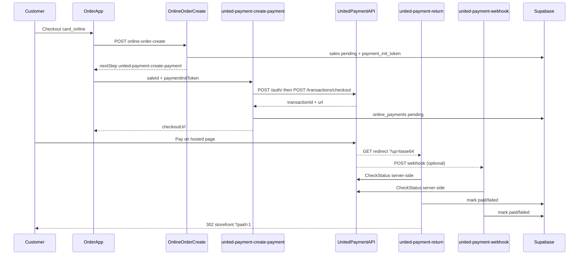

# United Payment integration (hosted checkout)

Card payments on **order.mings.az** use **United Payment** hosted checkout (`/transactions/checkout`). EPoint remains as legacy for historical `online_payments` rows.

## Architecture



## Edge functions

| Function | Role |
|----------|------|
| `united-payment-create-payment` | Auth + checkout; creates `online_payments` row |
| `united-payment-return` | Browser redirect handler; decodes `up`, re-confirms status |
| `united-payment-webhook` | Async callback; decodes payload, **re-confirms status** (does not trust body alone) |
| `united-payment-status-check` | Internal reconcile (`Bearer PAYMENT_RECONCILE_SECRET`) |

Shared logic: [`supabase/functions/_shared/unitedPayment.ts`](../supabase/functions/_shared/unitedPayment.ts), parser: [`unitedPaymentReturnParse.ts`](../supabase/functions/_shared/unitedPaymentReturnParse.ts).

## Redirect / webhook payload

United Payment redirects with a **base64 `up` query parameter** decoding to JSON:

```json
{
  "OrderId": "clientOrderId value",
  "Status": "APPROVED",
  "Transaction": 39918,
  "BankOrderId": "798048",
  "BankSessionId": "..."
}
```

Per United Payment (May 2026), the webhook sends the **same shape** as the redirect. Webhooks are **unsigned**; we always call **CheckStatus** before updating `online_payments` / `sales`.

## Test environment

| Item | Value |
|------|--------|
| API base | `https://test-vpos.unitedpayment.az/api` |
| Auth | `POST /auth/` body `{ "email", "password" }` |
| Checkout | `POST /transactions/checkout` header `x-auth-token` |
| Dashboard | `https://test-vpos.unitedpayment.az/client/login` |
| Postman | [TEST EN](https://documenter.getpostman.com/view/28991745/2sAYBRFYxp), [Webhook](https://documenter.getpostman.com/view/30976704/2sBXqFMhmY) |

Test cards (from Postman): PAN `4169 7413 3015 1778`, exp `06/27`, CVV `591`.

## Supabase Edge secrets

See [`.env.example`](../.env.example) `UNITED_PAYMENT_*` block. Minimum for checkout:

- `UNITED_PAYMENT_API_BASE` or individual `*_URL` overrides
- `UNITED_PAYMENT_EMAIL`, `UNITED_PAYMENT_PASSWORD`
- `APP_BASE_URL`, `UNITED_PAYMENT_FUNCTIONS_PUBLIC_URL`
- `UNITED_PAYMENT_WEBHOOK_URL` (included in checkout body when set)

**CheckStatus URLs** default to `/transactions/status/order/{clientOrderId}` and `/transactions/status/{transactionId}` — **confirm exact paths with United Payment** before production.

## Refunds

No refund/reverse API is documented in the United Payment checkout collections. Treat refunds as **dashboard-only** until United Payment confirms an API.

## Manual QA checklist (test gateway)

1. Place **takeaway + card_online** order on local/staging storefront.
2. Confirm redirect to United Payment hosted page.
3. Pay with test card → return URL shows `?paid=1`, sale `payment_status=paid`, KDS can accept order.
4. Decline/cancel path → `?payment_error=1`, sale stays unpaid, KDS blocks prep.
5. If webhook configured, confirm `online_payments.raw_payload` shows `status_check_ok: true`.

## Open questions for United Payment (Ilqar)

Copy-paste for WhatsApp/email:

---

Hello Ilqar,

We resumed integration on our side. A few items to confirm before go-live:

1. **CheckStatus** — What is the exact endpoint path and HTTP method to query status by `clientOrderId` and by `transactionId`? (We currently assume `GET /transactions/status/order/{clientOrderId}` and `GET /transactions/status/{transactionId}`.)

2. **Webhook body** — Does the webhook POST the same base64 `up` payload as the browser redirect, or raw JSON? What are the exact `Status` values for success, decline, and cancel?

3. **Refunds** — Is reverse/refund API available for our merchant, or dashboard-only?

4. **Go-live** — Please share production API base URL, merchant credentials, and confirm our webhook URL:
   `https://<project-ref>.supabase.co/functions/v1/united-payment-webhook`

Thank you.

---
